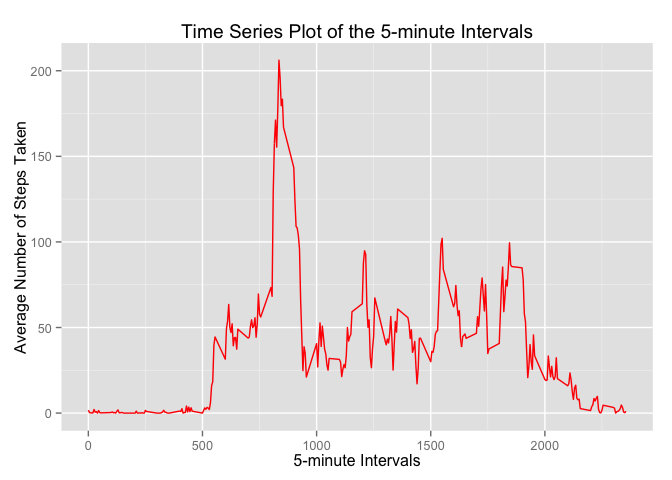
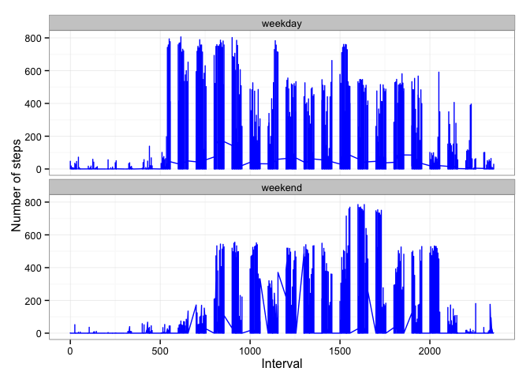

# Assignment1

Read in the data from the activity.csv file:

```r
data_in<-read.csv('activity.csv')
summary(data_in)
```

```
##      steps                date          interval     
##  Min.   :  0.00   2012-10-01:  288   Min.   :   0.0  
##  1st Qu.:  0.00   2012-10-02:  288   1st Qu.: 588.8  
##  Median :  0.00   2012-10-03:  288   Median :1177.5  
##  Mean   : 37.38   2012-10-04:  288   Mean   :1177.5  
##  3rd Qu.: 12.00   2012-10-05:  288   3rd Qu.:1766.2  
##  Max.   :806.00   2012-10-06:  288   Max.   :2355.0  
##  NA's   :2304     (Other)   :15840
```

What is the mean total number of steps taken per day?

First determine the total number of steps per day, by adding up the steps counted on each individual day, then find the mean of all days.


```r
data<-na.omit(data_in)
total_steps <- aggregate(steps~date, data, sum)
colnames(total_steps)<-c("date","steps")
head(total_steps)
```

```
##         date steps
## 1 2012-10-02   126
## 2 2012-10-03 11352
## 3 2012-10-04 12116
## 4 2012-10-05 13294
## 5 2012-10-06 15420
## 6 2012-10-07 11015
```

```r
mean_steps <- mean(total_steps$steps)
median_steps<-median(total_steps$steps)
mean_steps
```

```
## [1] 10766.19
```

```r
median_steps
```

```
## [1] 10765
```
Make a histogram of the total number of steps taken each day.

```r
hist(total_steps$steps, breaks=50, xlab="Total number of steps per day",main="Histogram of the Total Number of Steps")
```

 

What is the average daily activity pattern?

Make a time series plot (i.e. type = "l") of the 5-minute interval (x-axis) and the average number of steps taken, averaged across all days (y-axis)


```r
ave_steps<-aggregate(data$steps,list(data$interval),FUN="mean")
colnames(ave_steps)<-c("interval","average_steps")
head(ave_steps)
```

```
##   interval average_steps
## 1        0     1.7169811
## 2        5     0.3396226
## 3       10     0.1320755
## 4       15     0.1509434
## 5       20     0.0754717
## 6       25     2.0943396
```

```r
library(ggplot2) 
ggplot(ave_steps,aes(interval,average_steps)) + geom_line(color="red") + labs(title="Time Series Plot of the 5-minute Intervals", x="5-minute Intervals", y="Average Number of Steps Taken")
```

 

Which 5-minute interval, on average across all the days in the dataset, contains the maximum number of steps?


```r
max_interval<-ave_steps[ave_steps$average_steps==max(ave_steps$average_steps),]
max_interval
```

```
##     interval average_steps
## 104      835      206.1698
```

Imputing missing values

Note that there are a number of days/intervals where there are missing values (coded as NA). The presence of missing days may introduce bias into some calculations or summaries of the data.

Calculate and report the total number of missing values in the dataset (i.e. the total number of rows with NAs)

```r
sum(is.na(data_in))
```

```
## [1] 2304
```

Devise a strategy for filling in all of the missing values in the dataset. The strategy does not need to be sophisticated. For example, you could use the mean/median for that day, or the mean for that 5-minute interval, etc.
Create a new dataset that is equal to the original dataset but with the missing data filled in.


```r
data_fill<-data_in
ind_na <- which(is.na(data_in))
for (i in 1:length(ind_na)){
  tmp_interval<-data_in$interval[ind_na[i]]
  data_fill$steps[ind_na[i]]<-ave_steps$average_steps[ave_steps$interval==tmp_interval]
}
sum(is.na(data_fill))
```

```
## [1] 0
```
Make a histogram of the total number of steps taken each day and Calculate and report the mean and median total number of steps taken per day. Do these values differ from the estimates from the first part of the assignment? What is the impact of imputing missing data on the estimates of the total daily number of steps?

```r
total_steps_fill <- aggregate(steps~date, data_fill, sum)
colnames(total_steps_fill)<-c("date","steps")
head(total_steps_fill)
```

```
##         date    steps
## 1 2012-10-01 10766.19
## 2 2012-10-02   126.00
## 3 2012-10-03 11352.00
## 4 2012-10-04 12116.00
## 5 2012-10-05 13294.00
## 6 2012-10-06 15420.00
```

```r
hist(total_steps_fill$steps, breaks=50, xlab="Total number of steps per day",main="Histogram of the Total Number of Steps")
```

 

```r
mean_steps <- mean(total_steps_fill$steps)
median_steps<-median(total_steps_fill$steps)
mean_steps
```

```
## [1] 10766.19
```

```r
median_steps
```

```
## [1] 10766.19
```
The mean total number of steps is the same, but the median total number of steps differs from the first part of the assignment. There is very little impact of imputing the missing data, with only a very slight increase of the median.

Are there differences in activity patterns between weekdays and weekends?

For this part the weekdays() function may be of some help here. Use the dataset with the filled-in missing values for this part.

Create a new factor variable in the dataset with two levels – “weekday” and “weekend” indicating whether a given date is a weekday or weekend day.


```r
 data_fill$week<-factor(weekdays(as.Date(data_fill$date)) %in% c("Saturday","Sunday"),c("FALSE","TRUE"),c("weekday","weekend"))
 head(data_fill)
```

```
##       steps       date interval    week
## 1 1.7169811 2012-10-01        0 weekday
## 2 0.3396226 2012-10-01        5 weekday
## 3 0.1320755 2012-10-01       10 weekday
## 4 0.1509434 2012-10-01       15 weekday
## 5 0.0754717 2012-10-01       20 weekday
## 6 2.0943396 2012-10-01       25 weekday
```

```r
 summary(data_fill)
```

```
##      steps                date          interval           week      
##  Min.   :  0.00   2012-10-01:  288   Min.   :   0.0   weekday:12960  
##  1st Qu.:  0.00   2012-10-02:  288   1st Qu.: 588.8   weekend: 4608  
##  Median :  0.00   2012-10-03:  288   Median :1177.5                  
##  Mean   : 37.38   2012-10-04:  288   Mean   :1177.5                  
##  3rd Qu.: 27.00   2012-10-05:  288   3rd Qu.:1766.2                  
##  Max.   :806.00   2012-10-06:  288   Max.   :2355.0                  
##                   (Other)   :15840
```
Make a panel plot containing a time series plot (i.e. type = "l") of the 5-minute interval (x-axis) and the average number of steps taken, averaged across all weekday days or weekend days (y-axis). See the README file in the GitHub repository to see an example of what this plot should look like using simulated data.

```r
 ggplot(data_fill, aes(x=interval, y=steps)) + 
        geom_line(color="blue") + 
        facet_wrap(~ week, nrow=2, ncol=1) +
        labs(x="Interval", y="Number of steps") +
        theme_bw()
```

 
